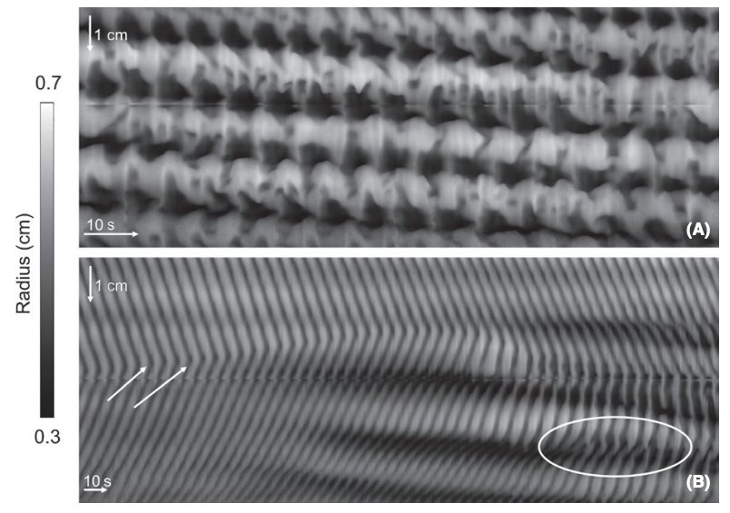

# DMapLE for Android

<picture></picture>

A common experimental technique in gastrointestinal motility is to remove a length of the gastrointestinal
tract ("gut") of an animal to a warmed and oxygenated "organ bath" of saline. Such an *[ex vivo](https://en.wikipedia.org/wiki/Ex_vivo)* preparation
will stay motile for several hours (depending on the skill of the experimentalist) and will display
many (but not all) of the contraction patterns seen *in vivo*. In the late 1990s, someone came up with 
the great idea of videoing the gut in its bath and analysing the video to extract the width of the gut
as a function of distance along the gut and time. This data could be displayed as a "diameter map",
an image with dimensions of space (distance along the gut) and time and pixel intensity (grey or color
scale) showing gut width ("diameter").

> Contractile (motility) patterns of a rabbit colon, in two diameter maps. Time runs from left to right. From Hanman A, Chen JH, Parsons SP, Huizinga JD. (2019) 
Noradrenaline inhibits neurogenic propulsive motor patterns but not neurogenic segmenting haustral 
progression in the rabbit colon. *Neurogastroenterol Motil.* 31, 13567,

I had previously written an ImageJ plugin for creating diameter maps from pre-recorded video. I called the plugin
DMapLE (pronounced *D maple*) in reference to diameter maps and the fact that I was living in Canada 
at the time ("maple"). This repository is a diameter mapping app for Android. It is quite different
UX to the ImageJ plugin. For starters, as cameras are built into most Android devices the maps are created
live from the camera feed. This was in fact the main motivation for developing the app, the fact that
maps could be created live with a single, cheap piece of tech - an android tablet or phone.

**This app is most definitely a work in progress.**

## References

Hennig et al. (1999). Quantitative analysis of peristalsis in the guinea-pig small intestine using 
spatio-temporal maps. *J Physiol.* 517, 575–590. [PubMed](https://pmc.ncbi.nlm.nih.gov/articles/PMC2269346/)

https://www.scepticalphysiologist.com/code/DMapLE/DMapLE.pdf

## Architecture

Each source code package includes a read-me that summarises the classes and their interconnection,
starting at the root, [here](app/src/main/java/com/scepticalphysiologist/dmaple).

## User Guide

