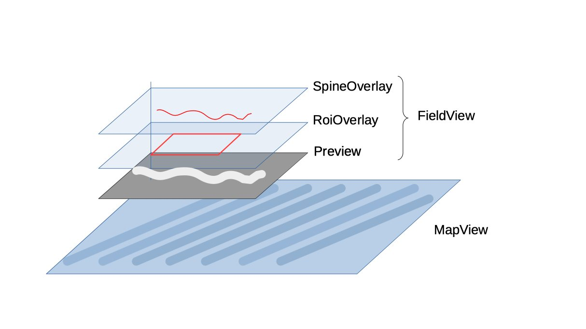
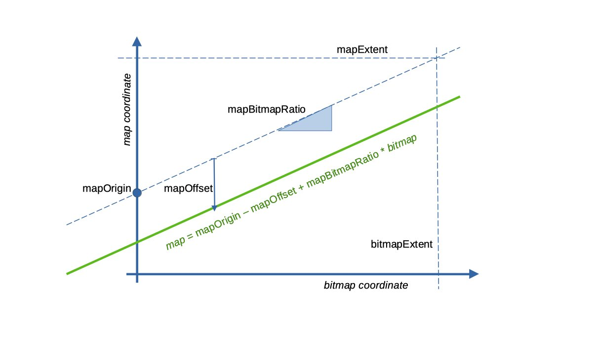
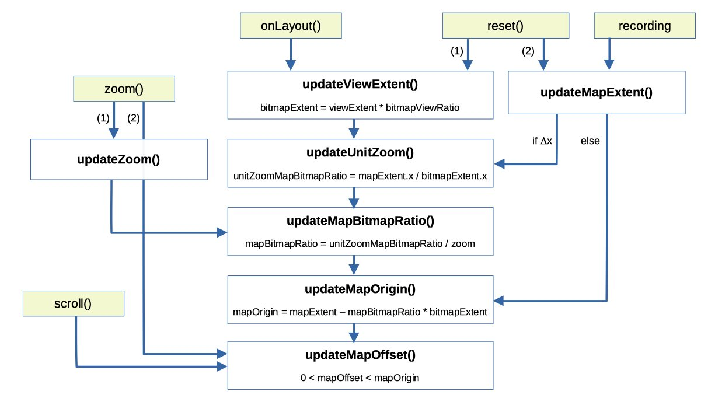

# Views of the Camera Field and Spatio-temporal Map

These classes make up the view of the [`Recorder`](../Recorder.kt) fragment. They form overlapping 
layers of a single frame layout, from top to bottom:

* [`FieldView`](FieldView.kt). The field-of-view of the camera and annotations drawn onto it.
  - [`SpineOverlay`](SpineOverlay.kt). Lines drawn along the "spine" of gut(s) while they are being mapped.
  - [`ROIOverlay`](RoiOverlay.kt). Rectangular regions-of-interest (ROIs) drawn by the user to indicate which
  guts are to be mapped and where.
  - `Preview` (`androidx.camera.view.PreviewView`). The camera feed.
* [`MapView`](MapView.kt). A spatio-temporal map, selected by tapping one of the ROIs.

|      |
|:---------------------------------------:|
| *View layers of the Recorder fragment.* |

When recording or viewing an old recording, the `FieldView` takes up the top-left of the fragment,
over the top of the`MapView`, and can be resized by dragging its lower-right corner. Otherwise, when not
recording, the `FieldView` takes up the whole fragment and the `MapView` is hidden.

## MapView

### Calculation of the map view port and conversion into a bitmap

$$  m = M_{orig} - M_{off} + bR_{mb} $$

$$ R_{mb} = \frac{R_{mb}^*}{Z} $$

$$ R_{mb}^* = \frac{m_{ext}(x)}{b_{ext}(x)}  $$

$$  0 \le M_{off} \le M_{orig} $$

$$ Z(x) \ge 1$$

The map viewport is then:

$$ max((0, 0), M_{orig} - M_{off}) : M_{orig} - M_{off} + b_{ext} R_{mb}$$

| symbol     | description                                          | `MapView` attribute      |
|------------|------------------------------------------------------|--------------------------|
| $x$        | space coordinate                                     |                          |
| $y$        | time coordinate                                      |                          |
| $b$        | bitmap $(x, y)$ coordinate                           | -                        |
| $m$        | map $(x, y)$ coordinate                              | -                        |
| $b_{ext}$  | the size of the bitmap if it takes up the whole view | `bitmapExtent`           |
| $m_{ext}$  | the size of the map                                  | `mapExtent`              |
| $M_{orig}$ |                                                      | `mapOrigin`              |
| $M_{off}$  | the offset of the view port from its leading edge    | `mapOffset`              |
| $R_{mb}$   | the ratio of map to bitmap pixels                    | `mapBitmapRatio`         |
| $R_{mb}^*$ | the ratio of map to bitmap pixels at zoom of one     | `unitZoomMapBitmapRatio` |
| $Z$        | zoom                                                 | `zoom`                   |

|  |
|:---------------------------------------:|
| *Bitmap to map coordinate conversion.*  |

|  |
|:----------------------------------------:|
|  *Call sequence when updating MapView.*  |

