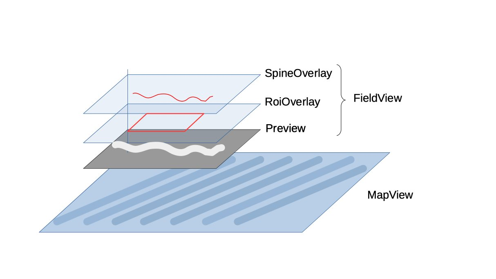

## record: Views of the Camera Field and Spatio-temporal Map

These classes make up the view of the [`Recorder`](../Recorder.kt) fragment. They form overlapping 
layers of a single frame layout, from top to bottom:

* [`FieldView`](FieldView.kt). The field-of-view of the camera and annotations drawn onto it.
  - [`SpineOverlay`](SpineOverlay.kt). Lines drawn along the "spine" of gut(s) while they are being mapped.
  - [`ROIOverlay`](RoiOverlay.kt). Rectangular regions-of-interest (ROIs) drawn by the user to indicate which
  guts are to be mapped and where.
  - `Preview` (`androidx.camera.view.PreviewView`). The camera feed.
* [`MapView`](MapView.kt). A spatio-temporal map, selected by tapping one of the ROIs.

When recording or viewing an old recording, the `FieldView` takes up the top-left of the fragment,
over the top of the`MapView`, and can be resized by dragging its lower-right corner. Otherwise, when not
recording, the `FieldView` takes up the whole fragment and the `MapView` is hidden.
